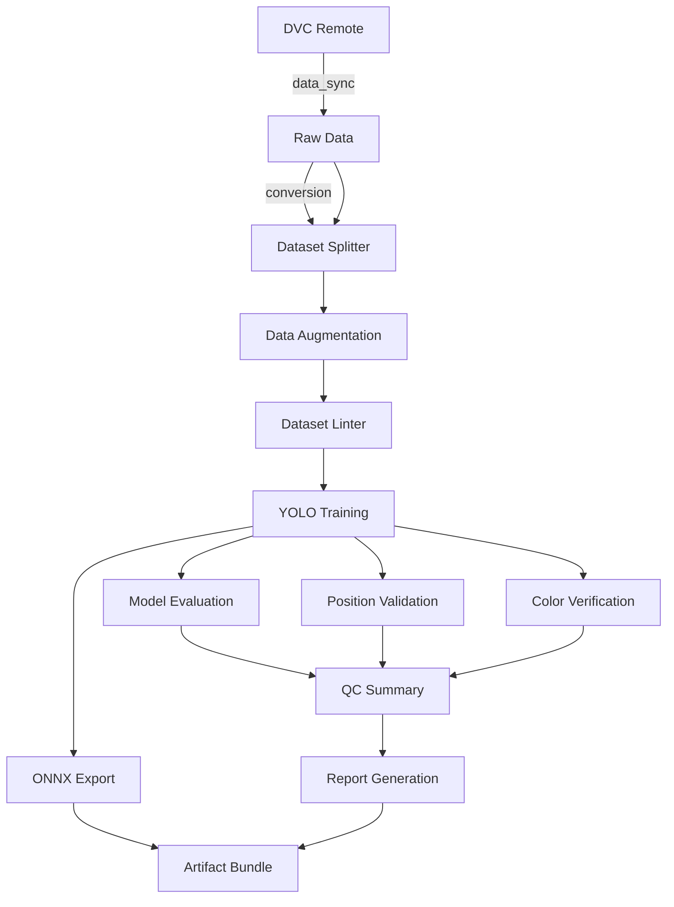

# Architecture Documentation

## System Overview

Yolo11_auto_train is a production-ready image processing and YOLO training pipeline toolkit that automates the entire workflow from data preparation to model deployment.

## Core Components

### 1. Pipeline System (`pipeline/`)
**Purpose**: Task orchestration and dependency management

**Key Classes**:
- `Pipeline` - Main orchestration engine
- `Task` - Individual task definition with dependencies

**Flow**:
```
Config → Pipeline → Task Collection → Dependency Resolution → Execution
```

### 2. Tasks (`tasks/`)
**Purpose**: Discrete processing steps

**Modules**:
- `training.py` - YOLO training and evaluation
- `quality.py` - QC tasks (lint, color verify, position validate)
- `augmentation.py` - Data augmentation
- `bundle.py` - Artifact bundling
- `conversion.py` - Format conversion
- `data_sync.py` - DVC data synchronization

### 3. Utilities (`utils/`)
**Purpose**: Reusable helper functions

**Key Modules**:
- `detection_config.py` - Configuration export
- `onnx_exporter.py` - ONNX model export
- `normalization.py` - Data normalization
- `validation.py` - Input validation
- `exceptions.py` - Custom exceptions

### 4. Processing Modules

**Split** (`split/`): Dataset splitting with stratification
**Augment** (`augment/`): Image augmentation with albumentations
**Format** (`format/`): Image format conversion
**Quality** (`quality/`): Dataset quality checking
**Position** (`position/`): Position validation
**Color** (`color/`): Color verification
**Eval** (`eval/`): Model evaluation
**Infer** (`infer/`): Batch inference
**Train** (`train/`): YOLO model training
**Data Sync** (`data_sync.py`): DVC raw dataset synchronization
**Conversion** (`conversion.py`): Image format and resizing conversion

### 5. GUI (`gui/`)
**Purpose**: User interface for pipeline configuration and execution

**Components**:
- `app.py` - Main application
- `config_editor.py` - Configuration editor
- `pipeline_controller.py` - Pipeline control
- `task_thread.py` - Background task execution

## Data Flow



## Configuration System

**File**: `configs/default_pipeline.yaml`

**Structure**:
```yaml
pipeline:
  default_tasks: [...]
  
train_test_split:
  input: {...}
  output: {...}
  
yolo_training:
  model: ...
  epochs: ...
  
yolo_evaluation: {...}
batch_inference: {...}
```

## Dependency Management

Uses pip-tools for reproducible builds:
- `requirements.in` → `requirements.txt` (213 deps)
- `requirements-dev.in` → `requirements-dev.txt`

See `DEPENDENCIES.md` for details.

## Error Handling

Custom exception hierarchy in `exceptions.py`:
- `PictureToolError` (base)
- `ConfigurationError`, `ValidationError`, etc.

Validation utilities in `validation.py`.

## Testing

- Framework: pytest
- Coverage target: 70% (excluding GUI)
- Current: ~19%
- Test organization: `tests/test_*_full.py`

## Extension Points

1. **Add new task**: Create in `tasks/`, add to `TASKS` list
2. **Add validation**: Use `validation.py` utilities
3. **Custom exceptions**: Inherit from `exceptions.py` classes
